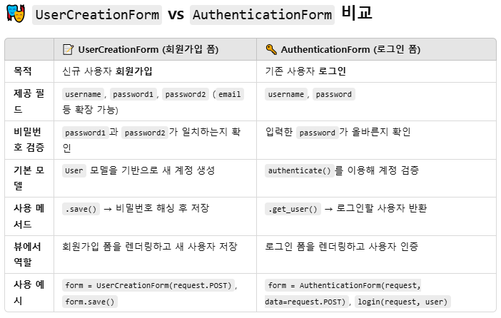

## auth 구조 
- 로그인 기능 
- user (modeling)
    - username
    - passward
    - name

- Post (유저가 작성하는 게시글) : 유저에 속함.
    - UniqueID
    - title
    - content 
    - user_id (ForeignKey) : 부모와 연결해줌

- => 1:N 관계 (한사람이 여러개의 게시글을 작성함.)

- Comment
    - UniqueID
    - content
    - user_id : User와 1:N
    - post_id : article과 1:N

- => 1:N 관계 (로그인 - 게시글 - 댓글 )

## 암호가 이루어 지는 구조
- 암호화 : 평문을 난수로 바꿈
    - hash함수 : sha1(암호로 유추가능) -> sha256(유추 불가)
    - salt  : sha로 생성된 숫자 + (랜덤 숫자) 붙이기


## 0. setting
- 프로젝트 이름 : auth .
- 앱 이름 : accounts 작성
- 공통 html 설정 : 밖에 templates에 base.html 만들기 

## 1. User 로그인 modeling
- `AbstractUser` : 사용자 인증을 위한 User 모델을 커스터마이징하고 싶을때
`models.py`
```python
from django.contrib.auth.models import AbstractUser
# Create your models here.

class User(AbstractUser):
    pass
    #phone = models.CharField(max_length=100) 기본에서 추가하고 싶은 기능
```

- `settings.py`
- 장고 Usermodel과 내가 만든 Usermodel이 충돌하기 때문에 내 User를 써달라고 해야 함.
    - AUTH_USER_MODEL = 'accounts.User'

- `migrations 하기`
- python manage.py makemigraions
- python manage.py migrate

## 2. create (signup 회원가입)
- `프로젝트 urls.py` : 앱으로 경로 설정 
```python 
from django.urls import path, include

urlpatterns = [
    path('admin/', admin.site.urls),
    path('accounts/', include('accounts.urls')),
]
```

- `앱 내 urls.py 생성` : 로그인 경로 설정
```python
from django.urls import path
from .import views

app_name = 'accounts'

urlpatterns = [
    path('signup/', views.signup, name = 'signup'),
]
```

`앱 내 forms.py 생성` : 장고 내에 UserCreationForm 불러옴.
```python
from .models import User
from django.contrib.auth.forms import UserCreationForm

class CustomUserCreationForm(UserCreationForm):
    class Meta():
        model = User
        fields= ('username',) # username만 / but, password는 필수라서 같이 나옴
# UserCreationForm : 장고가 만든 User대신 내가 만든 Userform을 사용
```

`앱 내 views.py` : 종이 보여주기
```python
from .forms import CustomUserCreationForm

# Create your views here.

def signup(request):
    if request.method == 'POST':
        pass
    else:    # 1) get 요청 (내가 만든 Userform)
        form = CustomUserCreationForm()

    context = {
        'form':form,
    }
    return render(request, 'signup.html', context)
```
`signup.html` : base.html 기반
```



    {{form}}

```
- `views.py`
```python
def signup(request):
    if request.method == 'POST': #post일때 내가 커스텀한 form 불러오기
        form = CustomUserCreationForm(request.POST)
```

- `signup.html` : form의 method POST인 겨우/ 제출버튼 만들기 
```



    <form action="" method="POST">
        
        {{form}}
        <input type="submit">
    </form>

```
 
## 3. 로그인 기본 구조
- user -> myid, mypassward를 장고에게 전달 -> session 값을 create -> cookie에 저장
    - cookie : session값이 저장되어 있으면 로그인
    - expire_date: 짧을수록 로그인 다시 해야 함. (보통 2주)



### 3.1 create (login 로그인)
`앱 내 urls.py` : 로그인 경로 설정
```python
path('login/', views.login, name='login'),
```

`앱 내 forms.py` : form login 생성
```python
class CustomAuthenticationForm(AuthenticationForm):
    pass
```

`앱 내 views.py` : login 함수 만들기
```python
from django.contrib.auth import login as auth_login # 내가 만든 함수 login과 중복되므로 장고 login의 이름을 바꿈.

def login(request):
    if request.method == 'POST':  # session 정보 생성
        form = CustomAuthenticationForm(request, request.POST)
        if form.is_valid():
            auth_login(request, form.get_user()) # 로그인할 사용자 반환
            return redirect('accounts:login') # 게시글의 인덱스 페이지로


    else:   #로그인 get 요청 보여주기
        form = CustomAuthenticationForm()

    context = {
        'form':form,
    }
    
    return render(request, 'login.html', context)
```
### 3.2 create(로그아웃)
`앱 내 urls.py` : 로그아웃 경로 만들기
```
path('logout/', views.logout, name = logout)
```

`앱 내 views.py` : 로그아웃 함수 만들기
```python
def logout(request):
    auth_logout(request)
    return redirect('accounts:login')
```

### 3.3 로그인 유무에 따른 nav 구조 변경
- `base.html`
```python
<nav class="nav">
         # if문으로 로그인할때 User, logout
        <a href="" class="nav-link disabled">{{user}}</a>
        <a href="" class="nav-link">logout</a>

         # else문 로그아웃할때 signup, login
        <a href="" class="nav-link">signup</a>
        <a href="" class="nav-link">login</a>

        
    </nav>
```

## 4. article modeling (게시글 만들기)
- 앱 설정 `python manage.py startapp articles`
- settings에 앱 적기 
- `modeling`
```python
from django.conf import settings # 2

# Create your models here.
class Article(models.Model):
    title = models.CharField(max_length=100)
    content = models.TextField()

    # 2. setting.py 변수 활용
    user = models.ForeignKey(settings.AUTH_USER_MODEL, on_delete=models.CASCADE)
```
- migrations
`urls.py` : articles 경로 설정
```python
from . import views

app_name = 'articles'

urlpatterns = [
    path('', views.index, name='index'),
    path('create/', views.create, name='create'),
]
```

`forms.py` : article form 만들기
```python
from .models import Article

class ArticleForm(ModelForm):
    class Meta():
        model = Article
        # fields = '__all__'
        # fields = ('title', 'content', ) # user 정보만 빼고 보여줌.
        exclude = ('user',)
```
`views.py`
```python
def index(request):
    articles = Article.objects.all()
    context = {
        'articles':articles,
    }
    return render(request, 'index.html',context)

def create(request):
     if request.method == 'POST':
         form = ArticleForm(request.POST) # title, content
         if form.is_valid(): 
             article = form.save(commit=False) # 임시 저장
             article.user = request.user # 로그인한 유저 정보
             article.save()
             return redirect('articles:index')
     else:
         form = ArticleForm()
     
     context = {
         'form':form,
     }
     return render(request, 'create.html', context)
```
## 프로젝트에 경로 설정
`path('articles/', include('articles.urls')),`

## login_required, next 인자 처리


### 단축평가 
- t -> t 
- f -> 두번째 정보 

## comment modeling, mirate


## comment

## 내가 작성한 게시글만 지울 수 있도록 로직 바꾸기
- 로그인한 사람 = 댓글 쓴 사람 일치할 때
    - -> if문으로 구현

- 직접 경로로 들어가면 게시글을 지울 수 있음 방지
    - -> if문으로 구현
```

    <a href="">update</a>
    <a href="">delete</a>
    
```

## 댓글 좋아요
- N:N : 좋아요 할 수 있는 기능이 한 계정당 하나


## 장고에 다른사람이 만든 라이브러리 사용하기 
`pip install django-bootstrap-v5`
    - 원래 장고를 지우고 라이브러리에 맞는 다른 버전의 장고를 설치해줌.

`settings.py` : 'bootstrap5' 앱 등록해주기

`signup.html`

